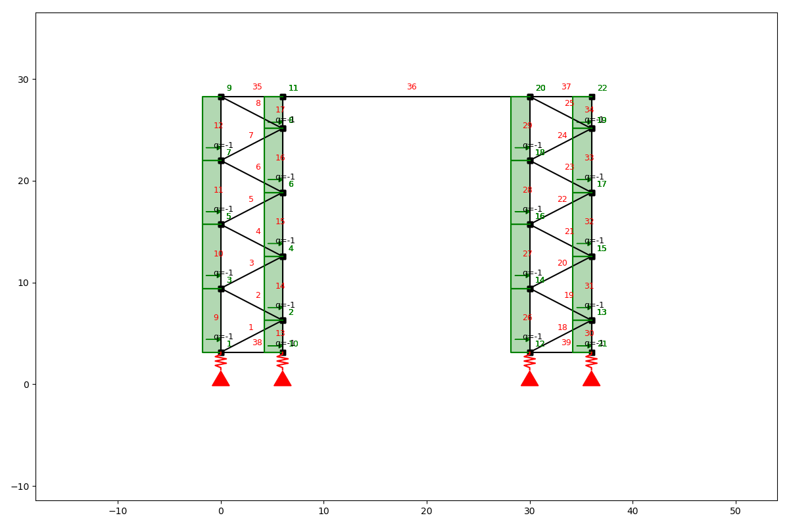
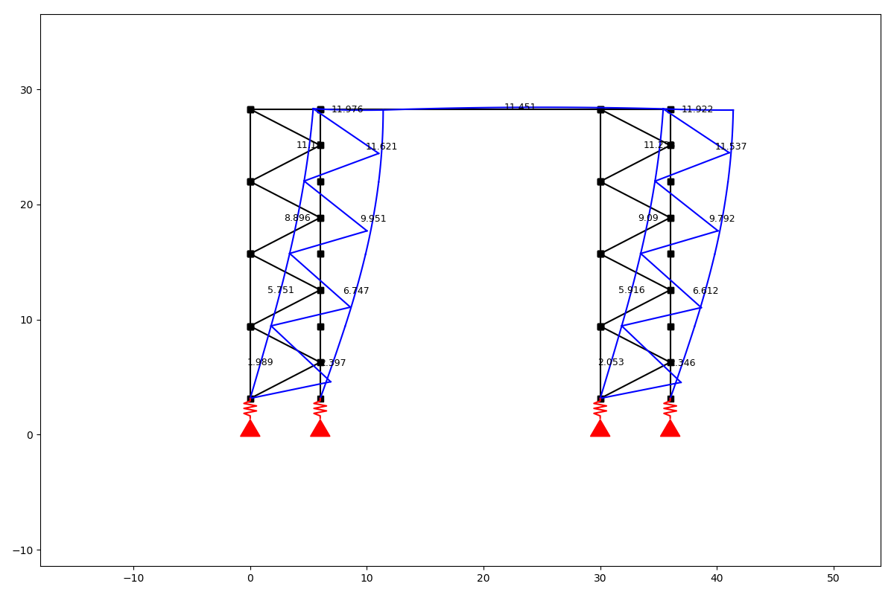
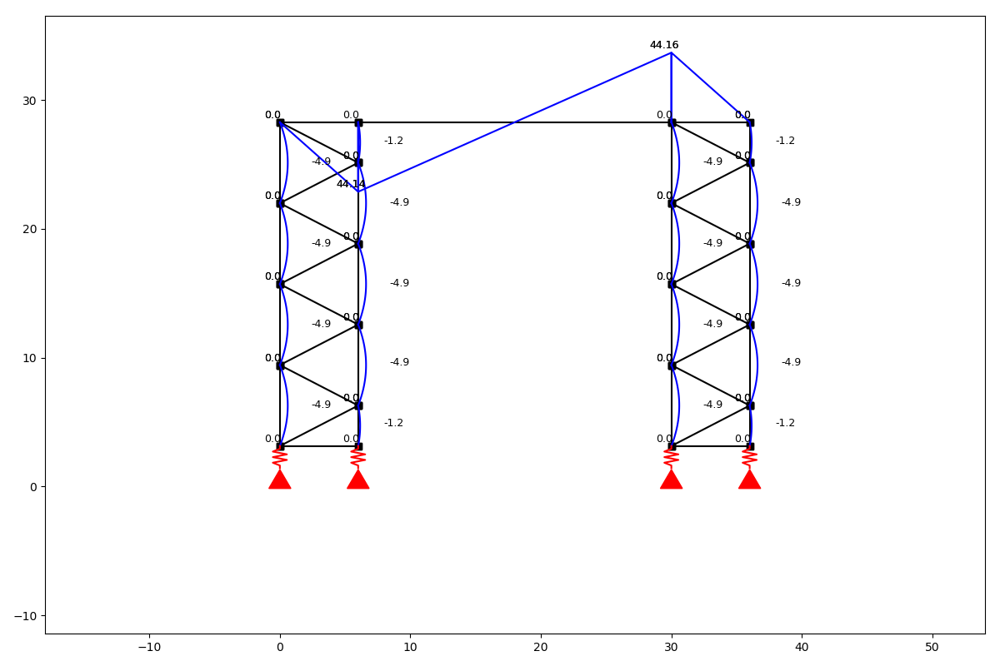
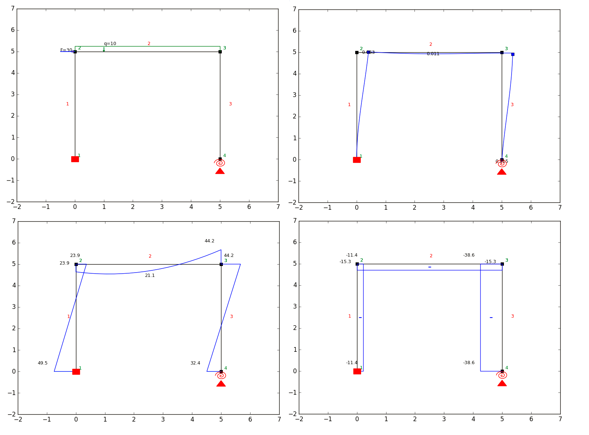

# anaStruct 2D Frames and Trusses

[](http://anastruct.readthedocs.io/en/latest/?badge=latest)
[](https://gitter.im/anaStruct/lobby?utm_source=badge&utm_medium=badge&utm_campaign=pr-badge)

Analyse 2D Frames and trusses for slender structures. Determine the bending moments, shear forces, axial forces and displacements.

## Installation

For the actively developed version:
```
$ pip install git+https://github.com/ritchie46/anaStruct.git
```

Or for a release:
```
$ pip install anastruct
```

## Read the docs!

[Documentation](http://anastruct.readthedocs.io)

## Questions

Got a question? Please ask on [gitter](https://gitter.im/anaStruct/lobby).

## Includes

* trusses :heavy_check_mark:
* beams :heavy_check_mark:
* moment lines :heavy_check_mark:
* axial force lines :heavy_check_mark:
* shear force lines :heavy_check_mark:
* displacement lines :heavy_check_mark:
* hinged supports :heavy_check_mark:
* fixed supports :heavy_check_mark:
* spring supports :heavy_check_mark:
* q-load in elements direction :heavy_check_mark:
* point loads in global x, y directions on nodes :heavy_check_mark:
* dead load :heavy_check_mark:
* q-loads in global y direction :heavy_check_mark:
* hinged elements :heavy_check_mark:
* rotational springs :heavy_check_mark:
* non-linear nodes :heavy_check_mark:
* geometrical non linearity :heavy_check_mark:
* load cases and load combinations :heavy_check_mark:
* generic type of section - rectangle and circle :heavy_check_mark:
* EU, US, UK steel section database :heavy_check_mark:

## Examples

```python
from anastruct import SystemElements
import numpy as np

ss = SystemElements()
element_type = 'truss'

# Create 2 towers
width = 6
span = 30
k = 5e3

# create triangles
y = np.arange(1, 10) * np.pi
x = np.cos(y) * width * 0.5
x -= x.min()

for length in [0, span]:
    x_left_column = np.ones(y[::2].shape) * x.min() + length
    x_right_column = np.ones(y[::2].shape[0] + 1) * x.max() + length

    # add triangles
    ss.add_element_grid(x + length, y, element_type=element_type)
    # add vertical elements
    ss.add_element_grid(x_left_column, y[::2], element_type=element_type)
    ss.add_element_grid(x_right_column, np.r_[y[0], y[1::2], y[-1]], element_type=element_type)

    ss.add_support_spring(
        node_id=ss.find_node_id(vertex=[x_left_column[0], y[0]]),
        translation=2,
        k=k)
    ss.add_support_spring(
        node_id=ss.find_node_id(vertex=[x_right_column[0], y[0]]),
        translation=2,
        k=k)

# add top girder
ss.add_element_grid([0, width, span, span + width], np.ones(4) * y.max(), EI=10e3)

# Add stability elements at the bottom.
ss.add_truss_element([[0, y.min()], [width, y.min()]])
ss.add_truss_element([[span, y.min()], [span + width, y.min()]])

for el in ss.element_map.values():
    # apply wind load on elements that are vertical
    if np.isclose(np.sin(el.ai), 1):
        ss.q_load(
            q=1,
            element_id=el.id,
            direction='x'
        )

ss.show_structure()
ss.solve()
ss.show_displacement(factor=2)
ss.show_bending_moment()

```








```python
from anastruct import SystemElements

ss = SystemElements(EA=15000, EI=5000)

# Add beams to the system.
ss.add_element(location=[0, 5])
ss.add_element(location=[[0, 5], [5, 5]])
ss.add_element(location=[[5, 5], [5, 0]])

# Add a fixed support at node 1.
ss.add_support_fixed(node_id=1)

# Add a rotational spring support at node 4.
ss.add_support_spring(node_id=4, translation=3, k=4000)

# Add loads.
ss.point_load(Fx=30, node_id=2)
ss.q_load(q=-10, element_id=2)

# Solve
ss.solve()

# Get visual results.
ss.show_structure()
ss.show_reaction_force()
ss.show_axial_force()
ss.show_shear_force()
ss.show_bending_moment()
ss.show_displacement()
```


### Real world use case.
[Non linear water accumulation analysis](https://ritchievink.com/blog/2017/08/23/a-nonlinear-water-accumulation-analysis-in-python/)
