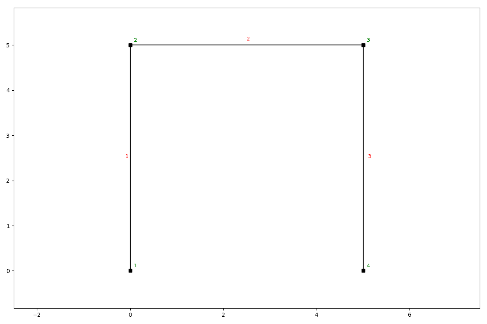
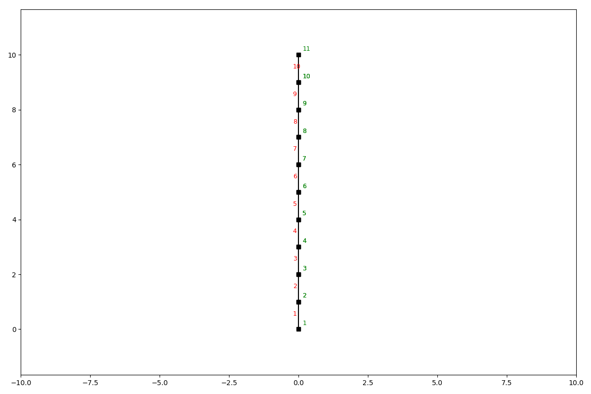
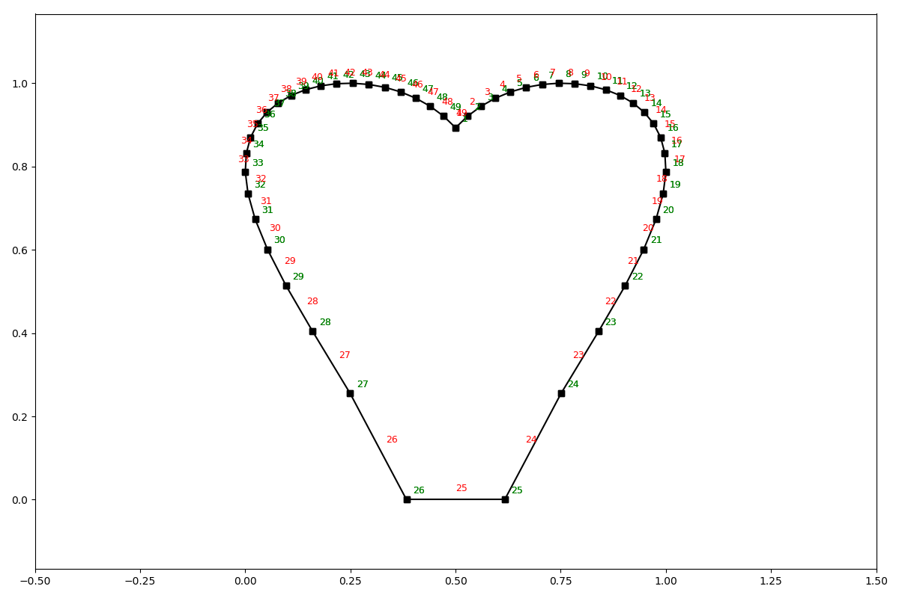

Elements
========

The SystemElements class has several methods that help you model a structure. These methods are;

* add_truss_element
* add_element
* add_multiple_elements
* discretize

A structure is defined by elements, which have their own state.

The elements are stored in `SystemElement.element_map`. This is a dictionary with keys representing the element ids, and
values being the element objects. The element objects ar implicitly created by the SystemElements object.

The state of an element can be interesting when
post-processing results. For now we'll focus on the modelling part. Below you see the different methods for modelling
a structure.

Standard elements
-----------------

Standard elements have bending and axial stiffness and therefore will implement shear force, bending moment, axial force,
extension, and deflection. Standard elements can be added with the following methods.

Add a single element
####################

.. automethod:: anastruct.fem.system.SystemElements.add_element

Example
.......

.. code-block:: python

    ss = SystemElements(EA=15000, EI=5000)
    ss.add_element(location=[[0, 0], [0, 5]])
    ss.add_element(location=[[0, 5], [5, 5]])
    ss.add_element(location=[[5, 5], [5, 0]])
    ss.show_structure()

Add multiple elements
#####################

.. automethod:: anastruct.fem.system.SystemElements.add_multiple_elements

Example add_multiple_elements
.............................

.. code-block:: python

    ss = SystemElements(EI=5e3, EA=1e5)
    ss.add_multiple_elements([[0, 0], [0, 10]], 10)
    ss.show_structure()

.. automethod:: anastruct.fem.system.SystemElements.add_element_grid

Example add_element_grid
........................

.. code-block:: python

    from anastruct import SystemElements
    import numpy as np

    # <3
    t = np.linspace(-1, 1)
    x = np.sin(t) * np.cos(t) * np.log(np.abs(t))
    y = np.abs(t)**0.3 * np.cos(t)**0.5 + 1
    # Scaling to positive interval
    x = (x - x.min()) / (x - x.min()).max()
    y = (y - y.min()) / (y - y.min()).max()

    ss = SystemElements()
    ss.add_element_grid(x, y)
    ss.show_structure()

Truss elements
--------------

Truss elements don't have bending stiffness and will therefore not implement shear force, bending moment and deflection.
It does model axial force and extension.

add_truss_element
#################

.. automethod:: anastruct.fem.system.SystemElements.add_truss_element

Discretization
--------------

You can discretize an element in multiple smaller elements with the discretize method.

.. automethod:: anastruct.fem.system.SystemElements.discretize

Insert node
-----------

Most of the nodes are defined when creating an element by passing the vertices (x, y coordinates) as the location
parameter. It is also to add a node to elements that already exist via the insert_node method.

.. automethod:: anastruct.fem.system.SystemElements.insert_node