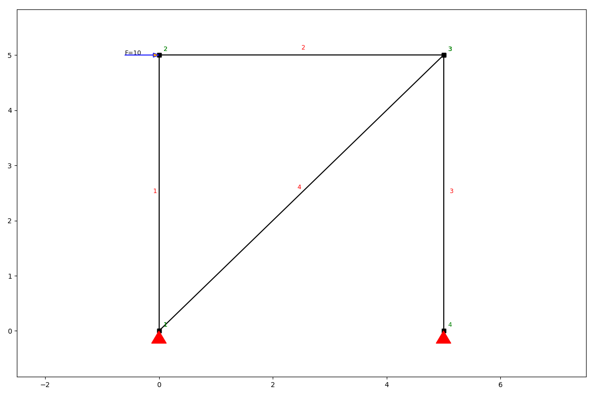
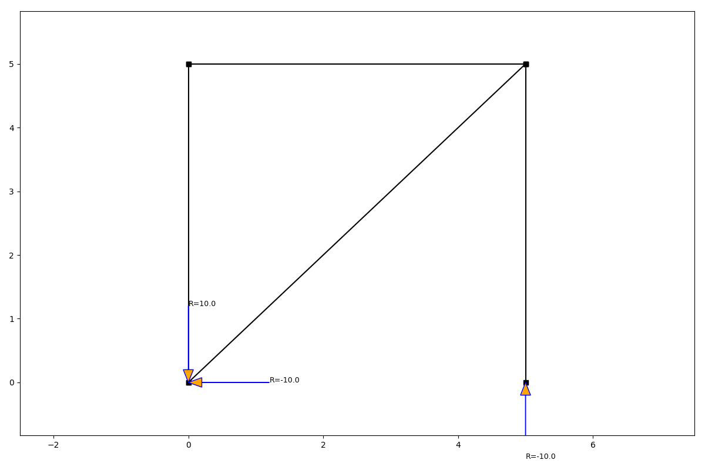
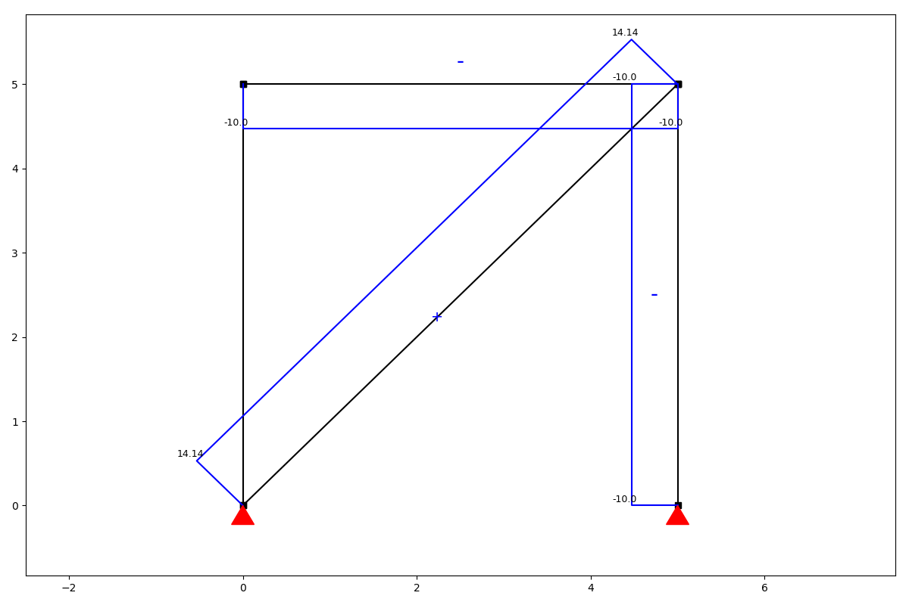
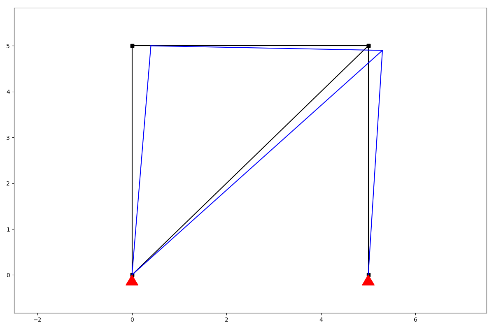

Examples
########

Examples below a side variety of the structures which aim to show capabilities of the package. The same as any other packages, anaStruct should be called and imported.

.. code-block:: python

    import anastruct as anas

And for a mater of minimalism and making calls and coding more efficient, different classes can be called separately.

.. code-block:: python
    :linenos:

    anas.LoadCase
    anas.LoadCombination
    anas.SystemElements
    anas.Vertex

Simple example - Truss
**********************

.. code-block:: python
    :linenos:

    ss = SystemElements(EA=5000)
    ss.add_truss_element(location=[[0, 0], [0, 5]])
    ss.add_truss_element(location=[[0, 5], [5, 5]])
    ss.add_truss_element(location=[[5, 5], [5, 0]])
    ss.add_truss_element(location=[[0, 0], [5, 5]], EA=5000 * math.sqrt(2))

    ss.add_support_hinged(node_id=1)
    ss.add_support_hinged(node_id=4)

    ss.point_load(Fx=10, node_id=2)

    ss.solve()
    ss.show_structure()
    ss.show_reaction_force()
    ss.show_axial_force()
    ss.show_displacement(factor=10)

Intermediate
############

.. code-block:: python
    :linenos:

    from anastruct import SystemElements
    import numpy as np

    ss = SystemElements()
    element_type = 'truss'

    # Create 2 towers
    width = 6
    span = 30
    k = 5e3

    # create triangles
    y = np.arange(1, 10) * np.pi
    x = np.cos(y) * width * 0.5
    x -= x.min()

    for length in [0, span]:
        x_left_column = np.ones(y[::2].shape) * x.min() + length
        x_right_column = np.ones(y[::2].shape[0] + 1) * x.max() + length

        # add triangles
        ss.add_element_grid(x + length, y, element_type=element_type)
        # add vertical elements
        ss.add_element_grid(x_left_column, y[::2], element_type=element_type)
        ss.add_element_grid(x_right_column, np.r_[y[0], y[1::2], y[-1]], element_type=element_type)

        ss.add_support_spring(
            node_id=ss.find_node_id(vertex=[x_left_column[0], y[0]]),
            translation=2,
            k=k)
        ss.add_support_spring(
            node_id=ss.find_node_id(vertex=[x_right_column[0], y[0]]),
            translation=2,
            k=k)

    # add top girder
    ss.add_element_grid([0, width, span, span + width], np.ones(4) * y.max(), EI=10e3)

    # Add stability elements at the bottom.
    ss.add_truss_element([[0, y.min()], [width, y.min()]])
    ss.add_truss_element([[span, y.min()], [span + width, y.min()]])

    for el in ss.element_map.values():
        # apply wind load on elements that are vertical
        if np.isclose(np.sin(el.angle), 1):
            ss.q_load(
                q=1,
                element_id=el.id,
                direction='x'
            )

    ss.show_structure()
    ss.solve()
    ss.show_displacement(factor=2)
    ss.show_bending_moment()

.. image:: img/examples/tower_bridge_struct.png

.. image:: img/examples/tower_bridge_displa.png

.. image:: img/examples/tower_bridge_moment.png

Advanced
#########

Take a look at this blog post. Here anaStruct was used to do a non linear water accumulation analysis. `Water accumulation blog post <https://www.ritchievink.com/blog/2017/08/23/a-nonlinear-water-accumulation-analysis-in-python/>`_.

.. code-block:: python
    :linenos:

    # import dependencies
    import matplotlib.pyplot as plt 
    from anastruct.basic import converge
    from anastruct.material.profile import HEA, IPE
    from anastruct.fem.system import SystemElements, Vertex
    from anastruct.material.units import to_kNm2, to_kN

    # constants
    E = 2.1e5  # Construction steels Young's modulus
    b = 5  # c.t.c distance portals
    q_water = 10 

    # axes height levels
    h_1 = 0
    h_2 = 0.258
    h_3 = 0.046
    h_4 = 0.274
    h_5 = 0.032
    h_6 = 0.15

    # beam spans
    span_1 = span_2 = 21.9
    span_3 = 8.9

    # Vertices at the axes
    p1 = Vertex(0, h_1)
    p2 = Vertex(span_1 * 0.5, h_2)
    p3 = Vertex(span_1, h_3)
    p4 = Vertex(span_1 + span_2 * 0.5, h_4)
    p5 = Vertex(span_1 + span_2, h_5)
    p6 = Vertex(span_1 + span_2 + span_3, h_6)

    def structure():
        """
        Build the structure from left to right, starting at axis 1.
        
        variables:
        EA = Young's modulus * Area
        EI = Young's modulus * moment of Inertia
        g = Weight [kN/ m]
        elements = reference of the element id's that were created
        dl = c.t.c distance different nodes.
        """
        
        dl = 0.2
        
        
        ## SPAN 1 AND 2
        
        # The elements between axis 1 and 3 are an IPE 450 member.
        EA = to_kN(E * IPE[450]['A'])  # Y
        EI = to_kNm2(E * IPE[450]["Iy"])
        g = IPE[450]['G'] / 100
        
        # New system.
        ss = SystemElements(mesh=3, plot_backend="mpl")
        
        # span 1
        first = dict(
            spring={1: 9e3}, 
            mp={1: 70},
        )
        
        elements = ss.add_multiple_elements(location=[p1, p2], dl=dl, first=first, EA=EA, EI=EI, g=g)
        elements += ss.add_multiple_elements(location=p3, dl=dl, EA=EA, EI=EI, g=g)
        
        # span 2
        first = dict(
            spring={1: 40e3},
            mp={1: 240}
        )
        elements += ss.add_multiple_elements(location=p4, dl=dl, first=first, EA=EA, EI=EI, g=g)
        elements += ss.add_multiple_elements(location=p5, dl=dl, EA=EA, EI=EI, g=g)
        
        
        ## SPAN 3
        
        # span 3
        # different IPE
        g = IPE[240]['G'] / 100
        EA = to_kN(E * IPE[240]['A'])
        EI = to_kNm2(E * IPE[240]["Iy"])
        first = dict(
            spring={1: 15e3}, 
            mp={1: 25},
        )
        
        elements += ss.add_multiple_elements(location=p6, first=first, dl=dl, EA=EA, EI=EI, g=g)
        
        # Add a dead load of -2 kN/m to all elements.
        ss.q_load(-2, elements, direction="y")
        
        
        ## COLUMNS
        
        # column height
        h = 7.2
        
        # left column
        EA = to_kN(E * IPE[220]['A'])
        EI = to_kNm2(E * HEA[220]["Iy"])
        left = ss.add_element([[0, 0], [0, -h]], EA=EA, EI=EI)
        
        # right column
        EA = to_kN(E * IPE[180]['A'])
        EI = to_kNm2(E * HEA[180]["Iy"])
        right = ss.add_element([p6, Vertex(p6.x, -h)], EA=EA, EI=EI)
        
            
        ## SUPPORTS
        
        # node ids for the support
        id_left = max(ss.element_map[left].node_map.keys())
        id_top_right = min(ss.element_map[right].node_map.keys())
        id_btm_right = max(ss.element_map[right].node_map.keys())
        
        # Add supports. The location of the supports is defined with the nodes id.
        ss.add_support_hinged((id_left, id_btm_right))

        # Retrieve the node ids at axis 2 and 3
        id_p3 = ss.find_node_id(p3)
        id_p5 = ss.find_node_id(p5)

        ss.add_support_roll(id_top_right, direction=1)
        
        # Add translational spring supports at axes 2 and 3
        ss.add_support_spring(id_p3, translation=2, k=2e3, roll=True)
        ss.add_support_spring(id_p5, translation=2, k=3e3, roll=True)
        return ss

    ss = structure()
    ss.show_structure(verbosity=1, scale=0.6)

    def water_load(ss, water_height, deflection=None):
        """
        :param ss: (SystemElements) object.
        :param water_height: (flt) Water level.
        :param deflection: (array) Computed deflection.
        :return (flt) The cubic meters of water on the structure
        """
        
        # The horizontal distance between the nodes.
        dl = np.diff(ss.nodes_range('x'))
        
        if deflection is None:
            deflection = np.zeros(len(ss.node_map))
            
        # Height of the nodes
        y = np.array(ss.nodes_range('y'))
        
        # An array with point loads. 
        # cubic meters * weight water
        force_water = (water_height - y[:-3] - deflection[:-3]) * q_water * b * dl[:-2]

        cubics = 0
        n = force_water.shape[0] 
        for k in ss.node_map:
            if k > n:
                break
            point_load = force_water[k - 1]
            
            if point_load > 0:
                ss.point_load(k, Fx=0, Fz=-point_load)
                cubics += point_load / q_water
                
        return cubics

    def det_water_height(c, deflection=None):
        """
        :param c: (flt) Cubic meters.
        :param deflection: (array) Node deflection values.
        :return (SystemElement, flt) The structure and the redistributed water level is returned.
        """
        wh = 0.1
        
        while True:
            ss = structure()
            cubics = water_load(ss, wh, deflection)
            
            factor = converge(cubics, c)
            if 0.9999 <= factor <= 1.0001:
                return ss, wh

            wh *= factor

    cubics = [0]
    water_heights = [0]

    a = 0
    deflection = None
    max_water_level = 0

    # Iterate from 8 m3 to 15 m3 of water.

    for cubic in range(80, 150, 5):  # This loop computes the results per m3 of storaged water.
        wh = 0.05
        lastwh = 0.2
        cubic /= 10
        
        print(f"Starting analysis of {cubic} m3")
                            
        c = 1
        for _ in range(100):  # This loop redistributes the water until the water level converges.
            
            # redistribute the water 
            ss, wh = det_water_height(cubic, deflection)
            
            # Do a non linear calculation!!
            ss.solve(max_iter=100, verbosity=1)
            deflection = ss.get_node_result_range("uy")
            
            # Some breaking conditions
            if min(deflection) < -1:
                print(min(deflection), "Breaking due to exceeding max deflection")
                break
            if 0.9999 < lastwh / wh < 1.001:
                print(f"Convergence in {c} iterations.")
                cubics.append(cubic)
                water_heights.append(wh)
                break
            
            lastwh = wh
            c += 1
            
        if wh > max_water_level:
            max_water_level = wh
        else:
            a += 1
            if a >= 2:
                print("Breaking. Water level isn't rising.")
                break

    plt.plot(ss.nodes_range('x')[:-2], [el.bending_moment[0] for el in list(ss.element_map.values())[:-1]])
    a = 0
    plt.plot([0, p6.x], [a, a], color="black")

    c = "red"
    a = 240
    plt.plot([p3.x - 5, p3.x + 5], [a, a], color=c)
    a = 25
    plt.plot([p5.x - 5, p5.x + 5], [a, a], color=c)
    a = 70
    plt.plot([p1.x - 5, p1.x + 5], [a, a], color=c)

    plt.ylabel("Bending moment [kNm]")
    plt.xlabel("Span [m]")
    plt.show()

    plt.plot(ss.nodes_range('x')[:-2], ss.nodes_range('y')[:-2])
    plt.plot(ss.nodes_range('x')[:-2], [a + b for a, b in zip(ss.nodes_range('y')[:-2], ss.get_node_result_range("uy")[:-2])])

    plt.ylabel("Height level roof when accumulating [m]")
    plt.xlabel("Span [m]")
    plt.show()

