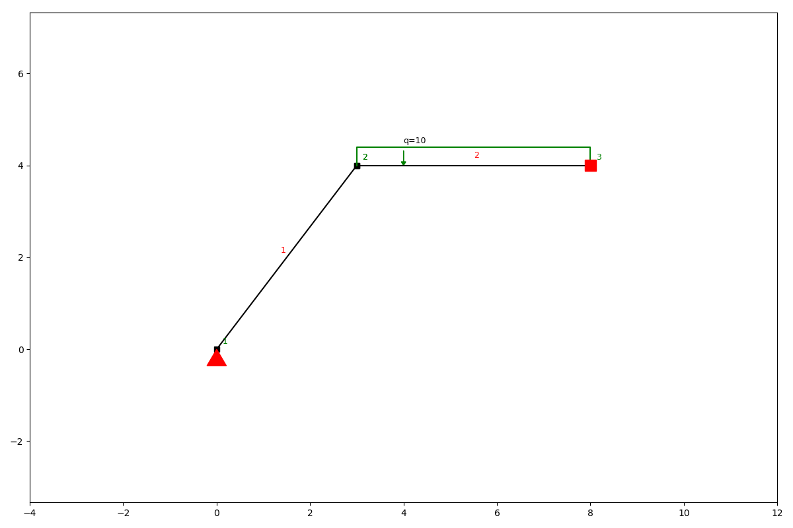
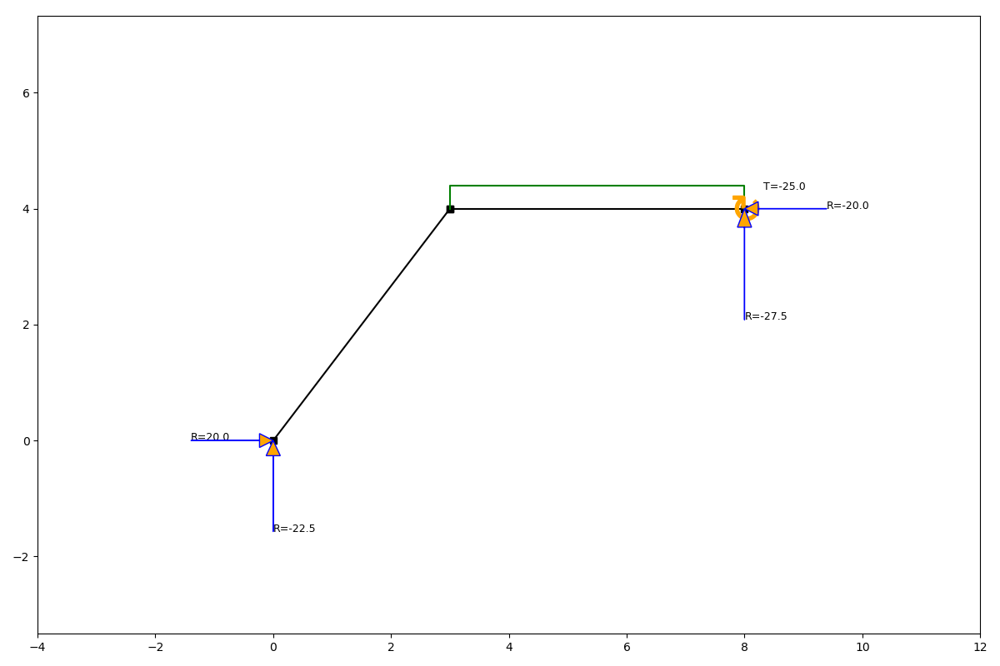
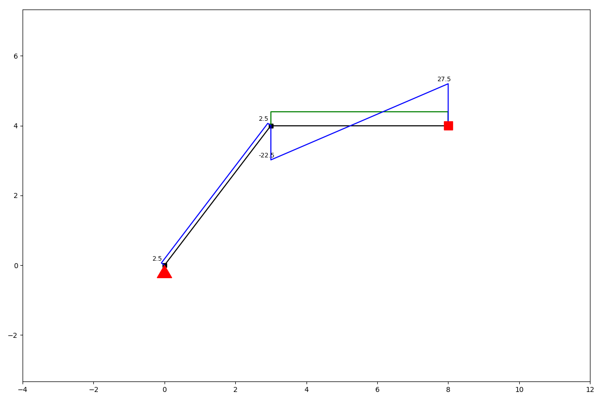
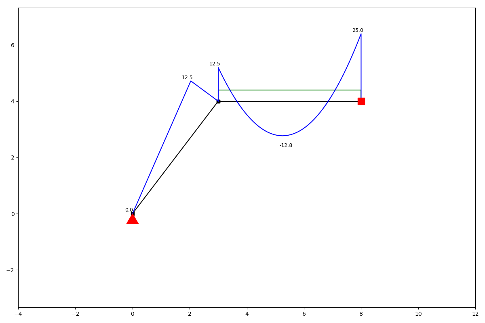
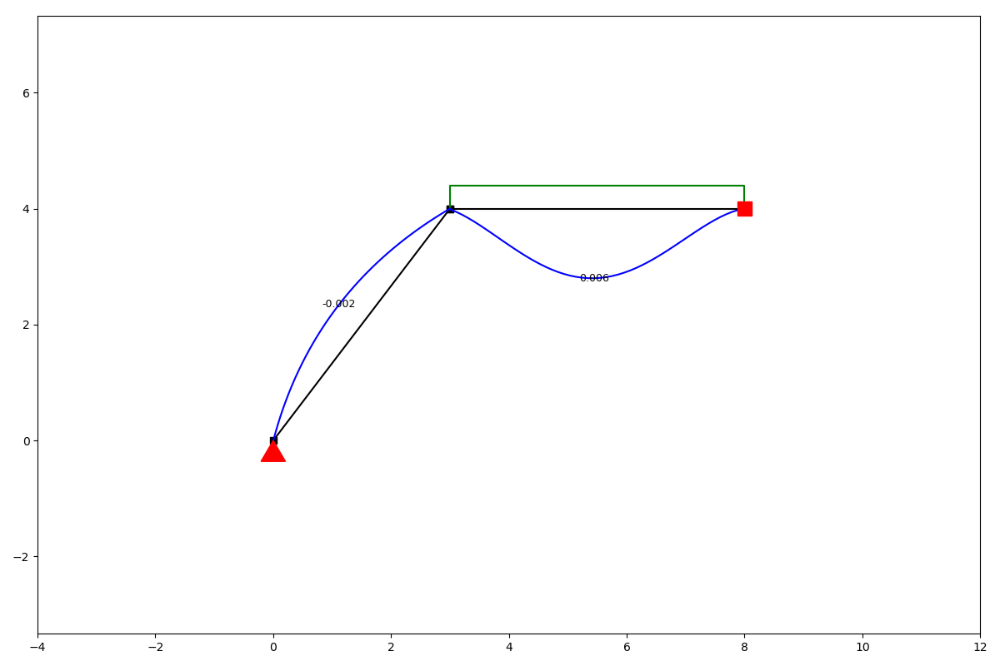

Getting started
===============

anaStruct is a Python implementation of the 2D Finite Element method for structures. It allows you to do structural
analysis of frames and frames. It helps you to compute the forces and displacements in the structural elements.

Besides linear calculations, there is also support for non-linear nodes and geometric non linearity.

Structure object
----------------

You start a model by instantiating a SystemElements object. All the models state, i.e. elements, materials and forces
are kept by this object.

.. automethod:: anastruct.fem.system.SystemElements.__init__

Example
#######

.. code-block:: python

    from anastruct.fem.system import SystemElements
    ss = SystemElements()

This *ss* object now has access to several methods which modify the state of the model. We can for instance create
a structure.

.. code-block:: python

    ss.add_element(location=[[0, 0], [3, 4]])
    ss.add_element(location=[[3, 4], [8, 4]])

Now we have elements, we need to define the supporting conditions of our structure.

.. code-block:: python

    ss.add_support_hinged(node_id=1)
    ss.add_support_fixed(node_id=3)

Finally we can add a load on the structure and compute the results.

.. code-block:: python

    ss.q_load(element_id=2, q=-10)
    ss.solve()

We can take a look at the results of the calculation by plotting different units we are interested in.

.. code-block:: python

    ss.show_structure()

.. code-block:: python

    ss.show_reaction_force()

.. code-block:: python

    ss.show_axial_force()

.. image:: img/getting_started/axial_force.png

.. code-block:: python

    ss.show_shear_force()

.. code-block:: python

    ss.show_bending_moment()

.. code-block:: python

    ss.show_displacement()

