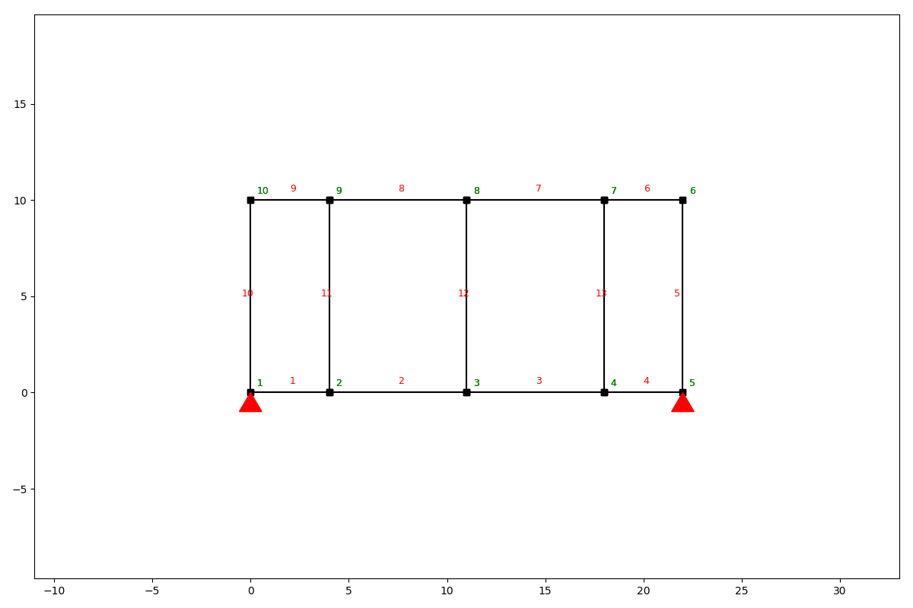
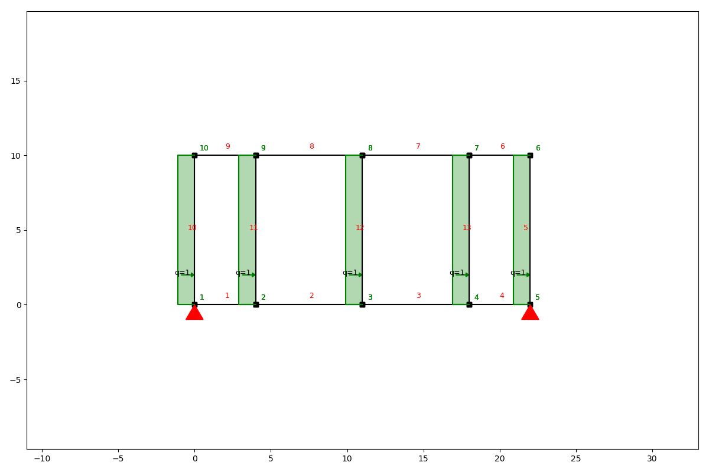
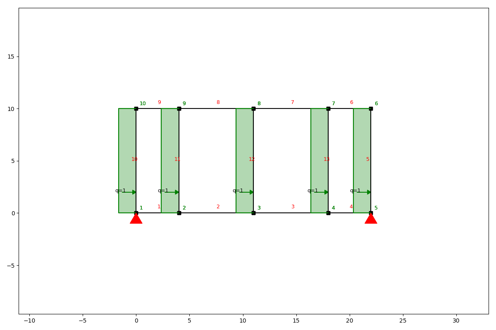
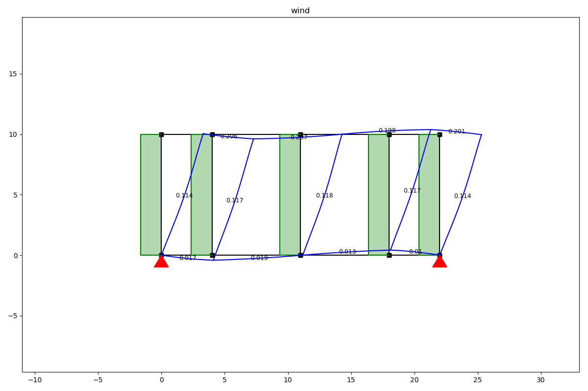
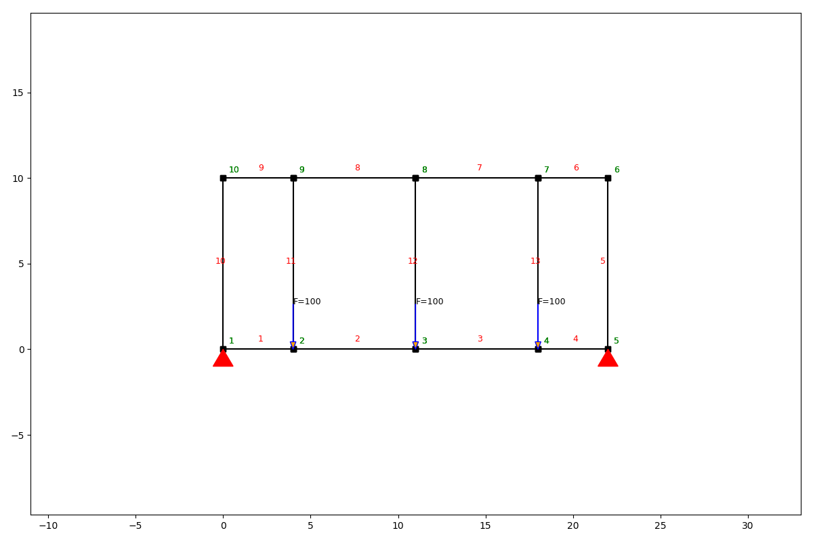
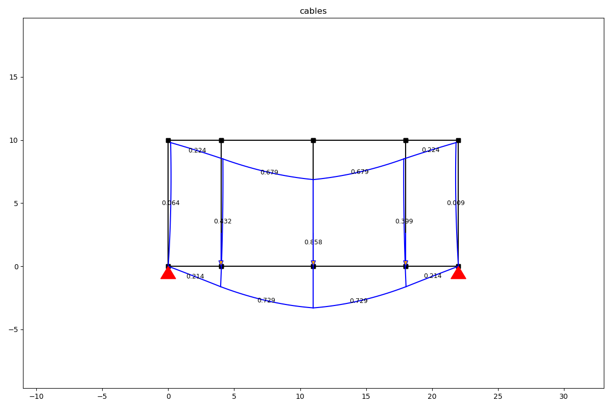

Load cases and load combinations
================================

Load cases
##########

You can group different loads in a single load case and add these to a SystemElements object. Let's look at an example.
First we create a frame girder.

.. code-block:: python

    from anastruct import SystemElements
    from anastruct import LoadCase, LoadCombination
    import numpy as np

    ss = SystemElements()
    height = 10

    x = np.cumsum([0, 4, 7, 7, 4])
    y = np.zeros(x.shape)
    x = np.append(x, x[::-1])
    y = np.append(y, y + height)

    ss.add_element_grid(x, y)
    ss.add_element([[0, 0], [0, height]])
    ss.add_element([[4, 0], [4, height]])
    ss.add_element([[11, 0], [11, height]])
    ss.add_element([[18, 0], [18, height]])
    ss.add_support_hinged([1, 5])
    ss.show_structure()

Now we can add a loadcase for all the wind loads.

.. code-block:: python

    lc_wind = LoadCase('wind')
    lc_wind.q_load(q=-1, element_id=[10, 11, 12, 13, 5])

    print(lc_wind)

**output**
::

    Loadcase wind:
    {'q_load-1': {'direction': 'element',
                  'element_id': [10, 11, 12, 13, 5],
                  'q': -1}}

And apply to the load case to our system.

.. code-block:: python

    # add the load case to the SystemElements object
    ss.apply_load_case(lc_wind)
    ss.show_structure()

Load combinations
#################

We can also combine load cases in a load combination with the `LoadCombination` class. First remove the previous load
case from the system, create a `LoadCombination` object and add the `LoadCase` objects to the `LoadCombination` object.

.. code-block:: python

    # reset the structure
    ss.remove_loads()

    # create another load case
    lc_cables = LoadCase('cables')
    lc_cables.point_load(node_id=[2, 3, 4], Fz=-100)

    combination = LoadCombination('ULS')
    combination.add_load_case(lc_wind, 1.5)
    combination.add_load_case(lc_cables, factor=1.2)

Now we can make a separate calculation for every load case and for the whole load combination. We solve the combination
by calling the `solve` method and passing our `SystemElements` model. The `solve` method returns a dictionary where
the keys are the load cases and the values are the unique `SystemElement` objects for every load case. There is also
a key `combination` in the results dictionary.

.. code-block:: python

results = combination.solve(ss)

for k, ss in results.items():
    results[k].show_structure()
    results[k].show_displacement(show=False)
    plt.title(k)
    plt.show()

**Load case wind**

**Load case cables**

**Combination**

.. image:: img/loadcase/combi.png

Load case class
###############

.. autoclass:: anastruct.fem.util.load.LoadCase
    :members:

    .. automethod:: __init__

Load combination class
######################

.. autoclass:: anastruct.fem.util.load.LoadCombination
    :members:

    .. automethod:: __init__
