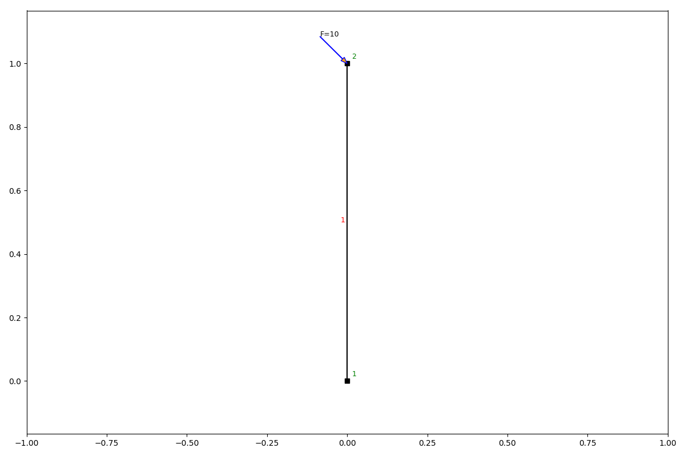
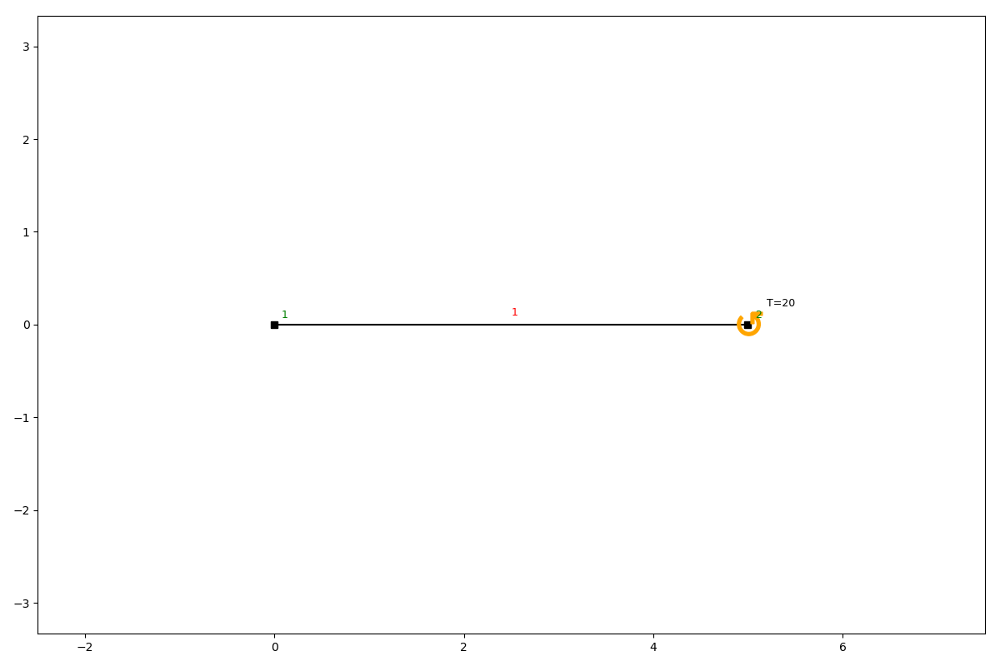
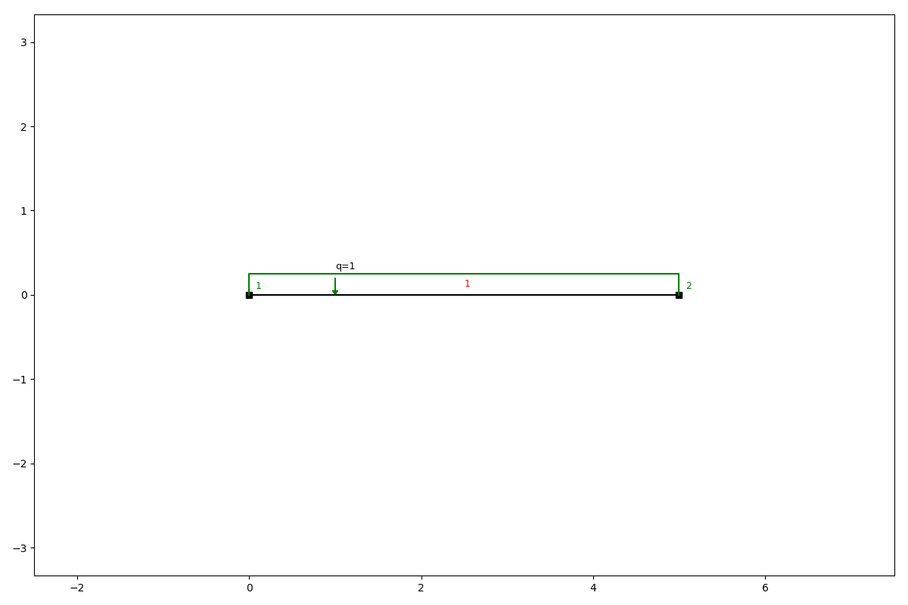

Loads
=====

anaStruct allows the following loads on a structure. There are loads on nodes and loads on elements. Element loads are
implicitly placed on the loads and recalculated during post processing.

Node loads
----------

Point loads
###########

Point loads are defined in x- and/ or y-direction, or by defining a load with an angle.

.. automethod:: anastruct.fem.system.SystemElements.point_load

Example
.......

.. code-block:: python

    ss.add_element(location=[0, 1])
    ss.point_load(ss.id_last_node, Fx=10, rotation=45)
    ss.show_structure()

Bending moments
###############

Moment loads apply a rotational force on the nodes.

.. automethod:: anastruct.fem.system.SystemElements.moment_load

Example
.......

.. code-block:: python

    ss.add_element([5, 0])
    ss.moment_load(node_id=ss.id_last_node, Ty=20)
    ss.show_structure()

Element loads
-------------

Q-loads are distributed loads. They can act perpendicular to the elements direction, parallel to the elements direction,
and in global x and y directions.

q-loads
#######

.. automethod:: anastruct.fem.system.SystemElements.q_load

Example
.......

.. code-block:: python

    ss.add_element([5, 0])
    ss.q_load(q=-1, element_id=ss.id_last_element, direction='element')
    ss.show_structure()

Remove loads
------------

.. automethod:: anastruct.fem.system.SystemElements.remove_loads
