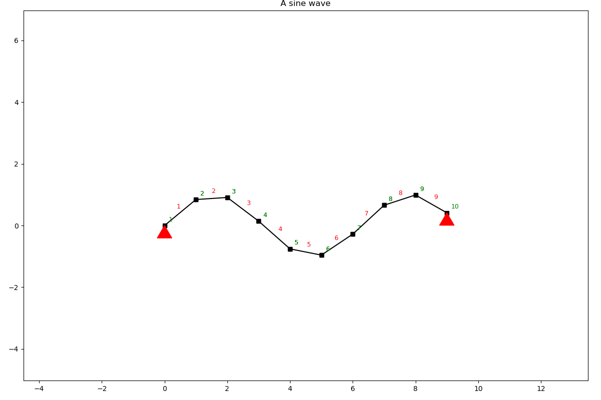

Plotting
========

The SystemElements object implements several plotting methods for retrieving standard plotting results. Every plotting
method has got the same parameters. The plotter is based on a Matplotlib backend and it is possible to get the figure
and do modifications of your own.

Structure
#########

.. automethod:: anastruct.fem.system.SystemElements.show_structure

Bending moments
###############

.. automethod:: anastruct.fem.system.SystemElements.show_bending_moment

Axial forces
############

.. automethod:: anastruct.fem.system.SystemElements.show_axial_force

Shear forces
############

.. automethod:: anastruct.fem.system.SystemElements.show_shear_force

Reaction forces
###############

.. automethod:: anastruct.fem.system.SystemElements.show_reaction_force

Displacements
#############

.. automethod:: anastruct.fem.system.SystemElements.show_displacement

Save figure
###########

When the `show` parameter is set to `False` a Matplotlib figure is returned and the figure can be saved with proper
titles.

.. code-block:: python

    from anastruct import SystemElements
    import numpy as np
    import matplotlib.pyplot as plt

    x = np.arange(0, 10)
    y = np.sin(x)

    ss = SystemElements()
    ss.add_element_grid(x, y)
    ss.add_support_hinged(node_id=[1, -1])

    fig = ss.show_structure(show=False)
    plt.title('A sine wave')
    plt.savefig('my-figure.png')

