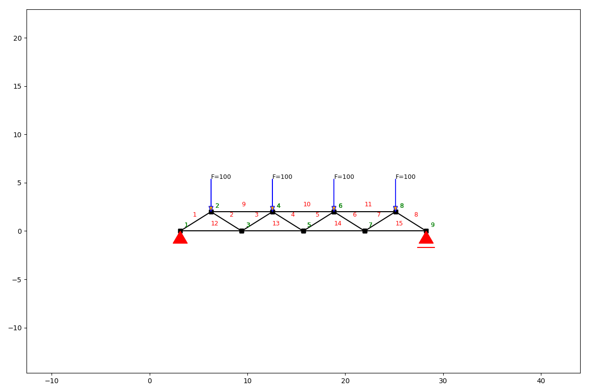
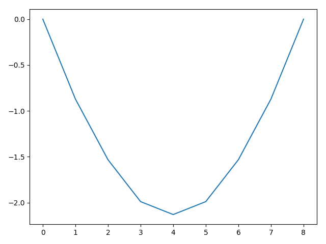

Post processing
===============

Besides plotting the result, it is also possible to query numerical results. We'll go through them with a simple
example.

.. code-block:: python

    from anastruct import SystemElements
    import matplotlib.pyplot as plt
    import numpy as np

    ss = SystemElements()
    element_type = 'truss'

    # create triangles
    x = np.arange(1, 10) * np.pi
    y = np.cos(x)
    y -= y.min()
    ss.add_element_grid(x, y, element_type=element_type)

    # add top girder
    ss.add_element_grid(x[1:-1][::2], np.ones(x.shape) * y.max(), element_type=element_type)

    # add bottom girder
    ss.add_element_grid(x[::2], np.ones(x.shape) * y.min(), element_type=element_type)

    # supports
    ss.add_support_hinged(1)
    ss.add_support_roll(-1, 2)

    # loads
    ss.point_load(node_id=np.arange(2, 9, 2), Fy=-100)

    ss.solve()
    ss.show_structure()

Node results system
###################

.. automethod:: anastruct.fem.system.SystemElements.get_node_results_system

Example
........

We can use this method to query the reaction forces of the supports.

.. code-block:: python

    print(ss.get_node_results_system(node_id=1)['Fy'], ss.get_node_results_system(node_id=-1)['Fy'])

**output**
::

    199.9999963370603 200.00000366293816

Node displacements
##################

.. automethod:: anastruct.fem.system.SystemElements.get_node_displacements

Example
.......

We can also query node displacements on a node level (So not opposite, as with the system node results.) To get the
maximum displacements at node 5 (the middle of the girder) we write.

.. code-block:: python

    print(ss.get_node_displacements(node_id=5))

**output**
::

    {'id': 5, 'ux': 0.25637068208810526, 'uy': -2.129555426623823, 'phi_y': 7.11561178433554e-09}

Range of node displacements
###########################

.. automethod:: anastruct.fem.system.SystemElements.get_node_result_range

Example
.......

To get the deflection of all nodes in the girder, we use the `get_node_result_range` method.

.. code-block:: python

    deflection = ss.get_node_result_range('uy')
    print(deflection)
    plt.plot(deflection)
    plt.show()

**output**
::

    [-0.0, -0.8704241688181067, -1.5321803865868588, -1.9886711039126856, -2.129555426623823, -1.9886710728856773, -1.5321805004461058, -0.8704239570876975, -0.0]

Element results
###############

.. automethod:: anastruct.fem.system.SystemElements.get_element_results

Example
.......

Axial force, shear force and extension are properties of the elements and not of the nodes. To get this information, we
need to query the results from the elements.

Let's find the value of the maximum axial compression force, which is in element 10.

.. code-block:: python

    print(ss.get_element_results(element_id=10)['N'])

**output**
::

    -417.395490645013

Range of element results
########################

.. automethod:: anastruct.fem.system.SystemElements.get_element_result_range

Example
........

We can of course think of a structure where we do not know where the maximum axial compression force will occur.
So let's check if our assumption is correct and that the maximum force is indeed in element 10.

We query all the axial forces. The returned item is an ordered list. Because Python starts counting from zero, and
our elements start counting from one, we'll need to add one to get the right element. Here we'll see that the minimum
force (compression is negative) is indeed in element 10.

.. code-block:: python

    print(np.argmin(ss.get_element_result_range('axial')) + 1)

**output**
::

    10

