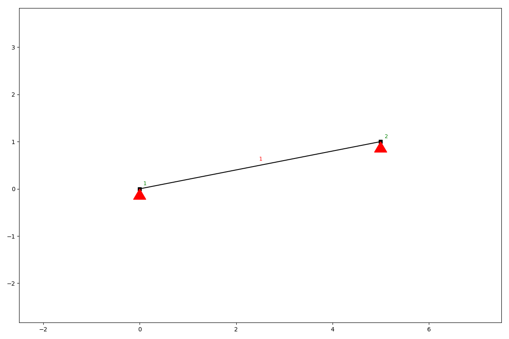
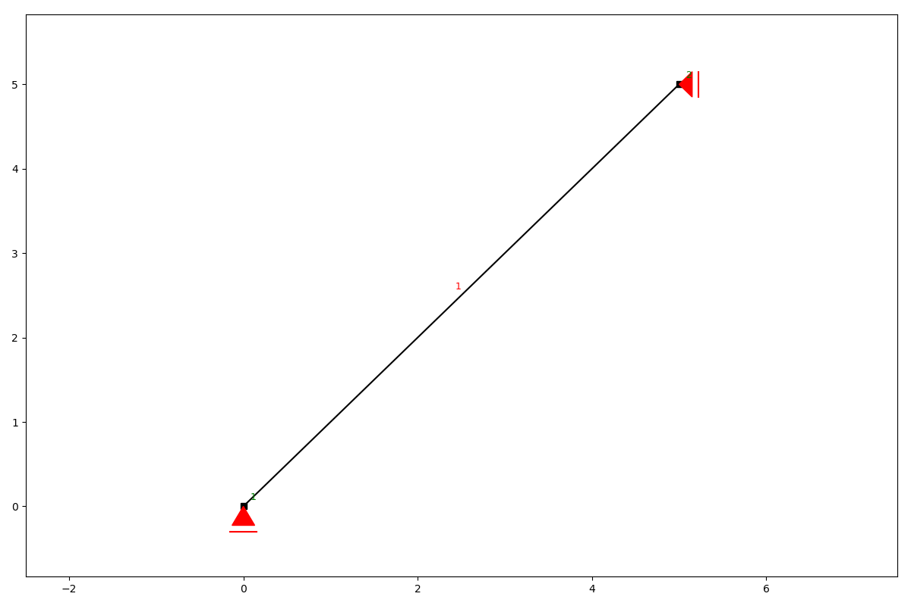
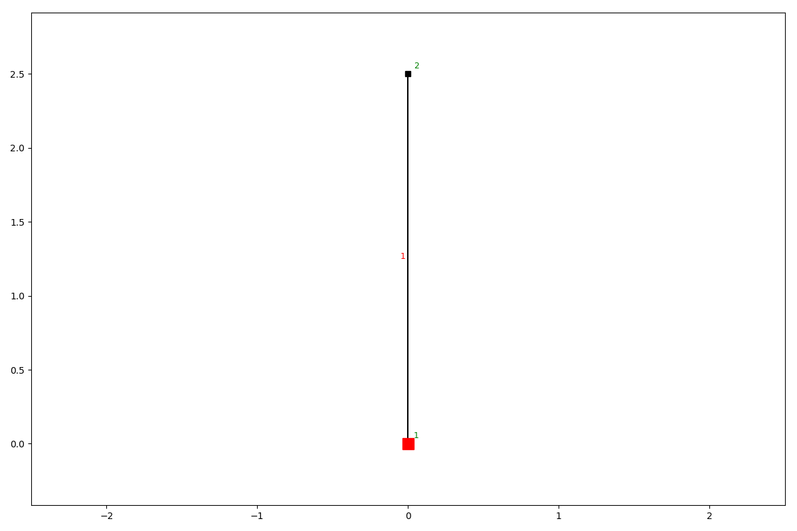
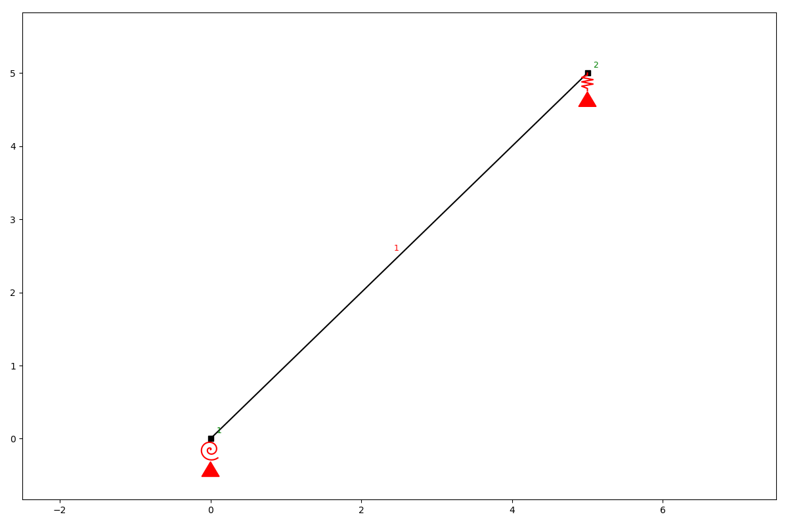

Supports
========

The following kinds of support conditions are possible.

* hinged (the node is able to rotate, but cannot translate)
* roll (the node is able to rotate and translation is allowed in one direction)
* fixed (the node cannot translate and not rotate)
* spring (translation and rotation are allowed but only with a linearly increasing resistance)

add_support_hinged
##################

.. automethod:: anastruct.fem.system.SystemElements.add_support_hinged

Example
.......

.. code-block:: python

    ss.add_element(location=[5, 1])
    ss.add_support_hinged(node_id=[1, 2])
    ss.show_structure()

add_support_roll
################

.. automethod:: anastruct.fem.system.SystemElements.add_support_roll

Example
.......

.. code-block:: python

    ss.add_element(location=[5, 5])
    ss.add_support_roll(node_id=2, direction=1)
    ss.add_support_roll(node_id=1, direction=2)
    ss.show_structure()

add_support_fixed
#################

.. automethod:: anastruct.fem.system.SystemElements.add_support_fixed

Example
.......

.. code-block:: python

    ss.add_element(location=[0, 2.5])
    ss.add_support_fixed(node_id=1)
    ss.show_structure()

add_support_spring
##################

Example
.......

.. code-block:: python

    ss.add_element(location=[5, 5])
    ss.add_support_spring(node_id=1, translation=3, k=1000)
    ss.add_support_spring(node_id=-1, translation=2, k=1000)
    ss.show_structure()

.. automethod:: anastruct.fem.system.SystemElements.add_support_spring