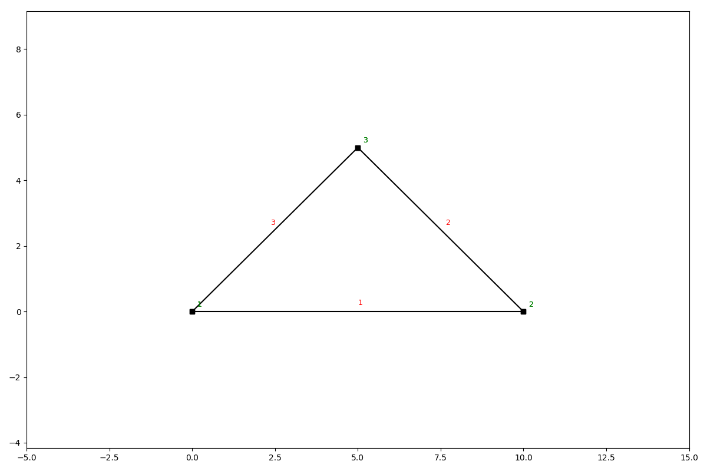

Vertex
======

Besides coordinates as a list such as `[[x1, y1], [x2, y2]]` anaStruct also has a utility node class called `Vertex`
Objects from this class can used to model elements and allow simple arithmetic on coordinates. Modelling with `Vertex`
objects can make it easier to model structures.

.. code-block:: python

    from anastruct import SystemElements, Vertex

    point_1 = Vertex(0, 0)
    point_2 = point_1 + [10, 0]
    point_3 = point_2 + [-5, 5]

    ss = SystemElements()
    ss.add_element([point_1, point_2])
    ss.add_element(point_3)
    ss.add_element(point_1)

    ss.show_structure()

